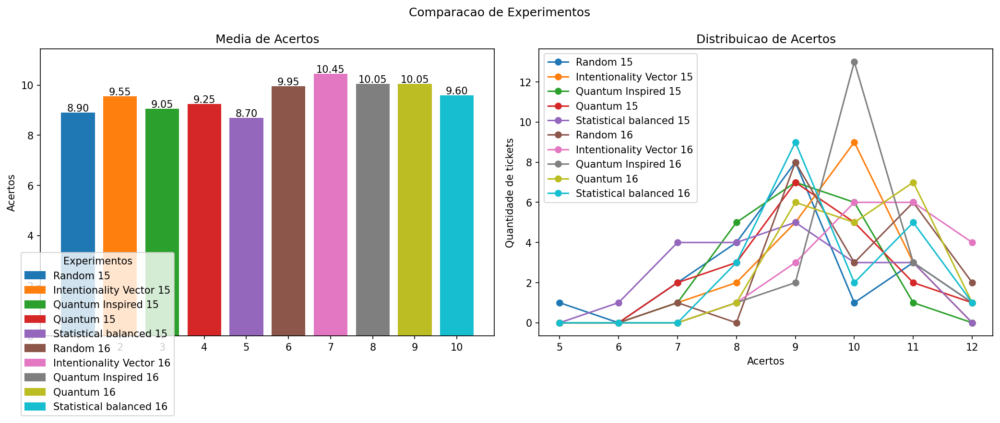
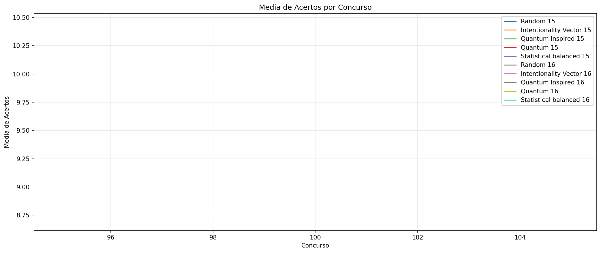
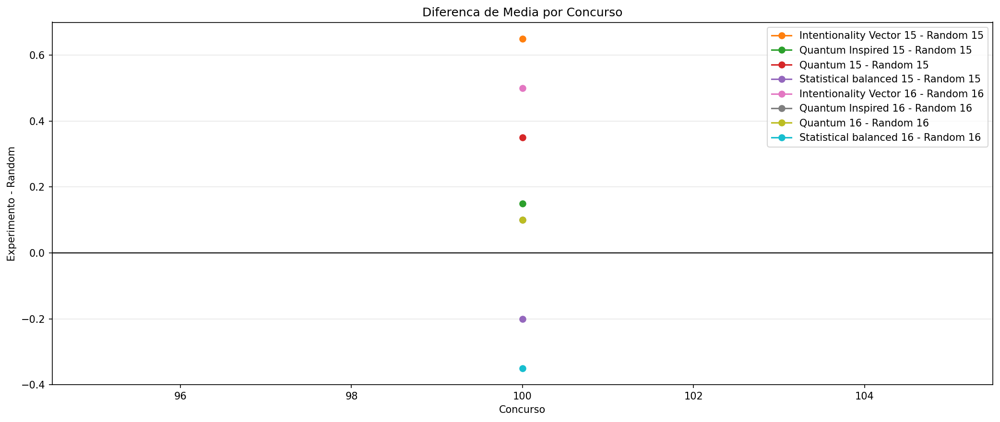
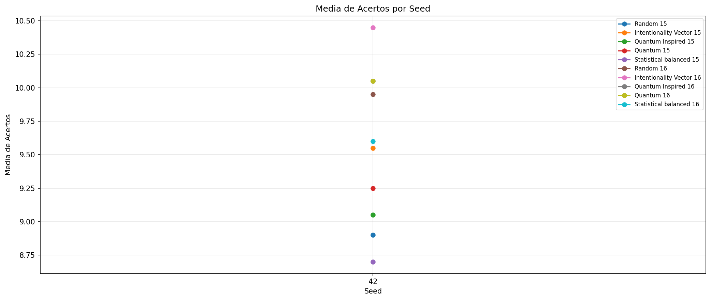
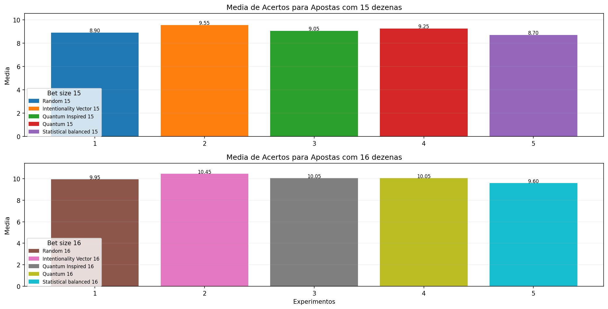

# Backtest Completo

- Data: 2026-04-07
- Concursos avaliados: 100 a 100
- Tickets por concurso: 20
- Tamanhos de aposta: 15, 16
- Janela de historico: 50
- Seed inicial: 42
- Quantidade de seeds: 1
- Seeds usadas: 42
- Presets comparados: balanced
- Runs totais: 10
- Concursos no intervalo: 1
- Tickets estimados: 200
- Custo estimado da bateria: R$ 5,950.00

## Estimativa de Custo

- 15 dezenas: R$ 350.00
- 16 dezenas: R$ 5,600.00

## Graficos

## Ranking Geral

- Melhor media: Intentionality Vector 16
- Melhor maximo de acertos: Random 15
- Melhor custo-beneficio: Intentionality Vector 15

### Ranking por Media

- Intentionality Vector 16: 10.45
- Quantum Inspired 16: 10.05
- Quantum 16: 10.05
- Random 16: 9.95
- Statistical balanced 16: 9.60
- Intentionality Vector 15: 9.55
- Quantum 15: 9.25
- Quantum Inspired 15: 9.05
- Random 15: 8.90
- Statistical balanced 15: 8.70

### Ranking por Maximo de Acertos

- Random 15: 12
- Quantum 15: 12
- Random 16: 12
- Intentionality Vector 16: 12
- Quantum Inspired 16: 12
- Quantum 16: 12
- Statistical balanced 16: 12
- Intentionality Vector 15: 11
- Quantum Inspired 15: 11
- Statistical balanced 15: 11

### Ranking por Custo-Beneficio

- Intentionality Vector 15: 2.728571
- Quantum 15: 2.642857
- Quantum Inspired 15: 2.585714
- Random 15: 2.542857
- Statistical balanced 15: 2.485714
- Intentionality Vector 16: 0.186607
- Quantum Inspired 16: 0.179464
- Quantum 16: 0.179464
- Random 16: 0.177679
- Statistical balanced 16: 0.171429

## Resumo por Seed

- Seed 42: media media=9.55, melhor max=12

## Resumo por Tamanho de Aposta

- 15 dezenas: media media=9.09, melhor max=12, melhor media por real=2.728571
- 16 dezenas: media media=10.02, melhor max=12, melhor media por real=0.186607

## Random 15

- Familia: random
- Preset: n/a
- Tamanho da aposta: 15
- Concursos avaliados: 1
- Tickets totais: 20
- Media de acertos: 8.90
- Maior numero de acertos: 12
- Menor numero de acertos: 5
- Custo da aposta: R$ 3.50
- Custo relativo: 1.00x
- Media por real: 2.542857
- Maximo por real: 3.428571

### Configuracao

- ticket_size: 15

### Distribuicao de Acertos

- 5 acertos: 1
- 7 acertos: 2
- 8 acertos: 4
- 9 acertos: 8
- 10 acertos: 1
- 11 acertos: 3
- 12 acertos: 1

### Resultados por Seed

- Seed 42: media=8.90, max=12, min=5

## Intentionality Vector 15

- Familia: intentionality_vector
- Preset: n/a
- Tamanho da aposta: 15
- Concursos avaliados: 1
- Tickets totais: 20
- Media de acertos: 9.55
- Maior numero de acertos: 11
- Menor numero de acertos: 7
- Custo da aposta: R$ 3.50
- Custo relativo: 1.00x
- Media por real: 2.728571
- Maximo por real: 3.142857

### Configuracao

- ticket_size: 15

### Distribuicao de Acertos

- 7 acertos: 1
- 8 acertos: 2
- 9 acertos: 5
- 10 acertos: 9
- 11 acertos: 3

### Resultados por Seed

- Seed 42: media=9.55, max=11, min=7

## Quantum Inspired 15

- Familia: quantum_inspired
- Preset: n/a
- Tamanho da aposta: 15
- Concursos avaliados: 1
- Tickets totais: 20
- Media de acertos: 9.05
- Maior numero de acertos: 11
- Menor numero de acertos: 7
- Custo da aposta: R$ 3.50
- Custo relativo: 1.00x
- Media por real: 2.585714
- Maximo por real: 3.142857

### Configuracao

- ticket_size: 15

### Distribuicao de Acertos

- 7 acertos: 1
- 8 acertos: 5
- 9 acertos: 7
- 10 acertos: 6
- 11 acertos: 1

### Resultados por Seed

- Seed 42: media=9.05, max=11, min=7

## Quantum 15

- Familia: quantum
- Preset: n/a
- Tamanho da aposta: 15
- Concursos avaliados: 1
- Tickets totais: 20
- Media de acertos: 9.25
- Maior numero de acertos: 12
- Menor numero de acertos: 7
- Custo da aposta: R$ 3.50
- Custo relativo: 1.00x
- Media por real: 2.642857
- Maximo por real: 3.428571

### Configuracao

- ticket_size: 15

### Distribuicao de Acertos

- 7 acertos: 2
- 8 acertos: 3
- 9 acertos: 7
- 10 acertos: 5
- 11 acertos: 2
- 12 acertos: 1

### Resultados por Seed

- Seed 42: media=9.25, max=12, min=7

## Statistical balanced 15

- Familia: statistical
- Preset: balanced
- Tamanho da aposta: 15
- Concursos avaliados: 1
- Tickets totais: 20
- Media de acertos: 8.70
- Maior numero de acertos: 11
- Menor numero de acertos: 6
- Custo da aposta: R$ 3.50
- Custo relativo: 1.00x
- Media por real: 2.485714
- Maximo por real: 3.142857

### Configuracao

- frequency_weight: 0.45
- delay_weight: 0.35
- parity_weight: 0.1
- range_weight: 0.1
- min_numbers_per_range: 2
- max_consecutive_run: 3
- max_repeats_from_last_draw: 11
- max_attempts: 250
- ticket_size: 15
- min_even_numbers: 6
- max_even_numbers: 9

### Distribuicao de Acertos

- 6 acertos: 1
- 7 acertos: 4
- 8 acertos: 4
- 9 acertos: 5
- 10 acertos: 3
- 11 acertos: 3

### Resultados por Seed

- Seed 42: media=8.70, max=11, min=6

## Random 16

- Familia: random
- Preset: n/a
- Tamanho da aposta: 16
- Concursos avaliados: 1
- Tickets totais: 20
- Media de acertos: 9.95
- Maior numero de acertos: 12
- Menor numero de acertos: 7
- Custo da aposta: R$ 56.00
- Custo relativo: 16.00x
- Media por real: 0.177679
- Maximo por real: 0.214286

### Configuracao

- ticket_size: 16

### Distribuicao de Acertos

- 7 acertos: 1
- 9 acertos: 8
- 10 acertos: 3
- 11 acertos: 6
- 12 acertos: 2

### Resultados por Seed

- Seed 42: media=9.95, max=12, min=7

## Intentionality Vector 16

- Familia: intentionality_vector
- Preset: n/a
- Tamanho da aposta: 16
- Concursos avaliados: 1
- Tickets totais: 20
- Media de acertos: 10.45
- Maior numero de acertos: 12
- Menor numero de acertos: 8
- Custo da aposta: R$ 56.00
- Custo relativo: 16.00x
- Media por real: 0.186607
- Maximo por real: 0.214286

### Configuracao

- ticket_size: 16

### Distribuicao de Acertos

- 8 acertos: 1
- 9 acertos: 3
- 10 acertos: 6
- 11 acertos: 6
- 12 acertos: 4

### Resultados por Seed

- Seed 42: media=10.45, max=12, min=8

## Quantum Inspired 16

- Familia: quantum_inspired
- Preset: n/a
- Tamanho da aposta: 16
- Concursos avaliados: 1
- Tickets totais: 20
- Media de acertos: 10.05
- Maior numero de acertos: 12
- Menor numero de acertos: 8
- Custo da aposta: R$ 56.00
- Custo relativo: 16.00x
- Media por real: 0.179464
- Maximo por real: 0.214286

### Configuracao

- ticket_size: 16

### Distribuicao de Acertos

- 8 acertos: 1
- 9 acertos: 2
- 10 acertos: 13
- 11 acertos: 3
- 12 acertos: 1

### Resultados por Seed

- Seed 42: media=10.05, max=12, min=8

## Quantum 16

- Familia: quantum
- Preset: n/a
- Tamanho da aposta: 16
- Concursos avaliados: 1
- Tickets totais: 20
- Media de acertos: 10.05
- Maior numero de acertos: 12
- Menor numero de acertos: 8
- Custo da aposta: R$ 56.00
- Custo relativo: 16.00x
- Media por real: 0.179464
- Maximo por real: 0.214286

### Configuracao

- ticket_size: 16

### Distribuicao de Acertos

- 8 acertos: 1
- 9 acertos: 6
- 10 acertos: 5
- 11 acertos: 7
- 12 acertos: 1

### Resultados por Seed

- Seed 42: media=10.05, max=12, min=8

## Statistical balanced 16

- Familia: statistical
- Preset: balanced
- Tamanho da aposta: 16
- Concursos avaliados: 1
- Tickets totais: 20
- Media de acertos: 9.60
- Maior numero de acertos: 12
- Menor numero de acertos: 8
- Custo da aposta: R$ 56.00
- Custo relativo: 16.00x
- Media por real: 0.171429
- Maximo por real: 0.214286

### Configuracao

- frequency_weight: 0.45
- delay_weight: 0.35
- parity_weight: 0.1
- range_weight: 0.1
- min_numbers_per_range: 2
- max_consecutive_run: 3
- max_repeats_from_last_draw: 11
- max_attempts: 250
- ticket_size: 16
- min_even_numbers: 7
- max_even_numbers: 10

### Distribuicao de Acertos

- 8 acertos: 3
- 9 acertos: 9
- 10 acertos: 2
- 11 acertos: 5
- 12 acertos: 1

### Resultados por Seed

- Seed 42: media=9.60, max=12, min=8