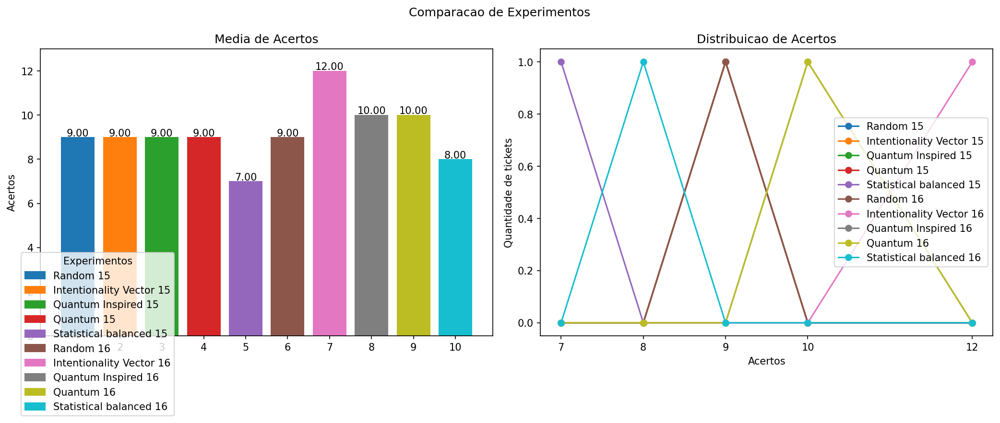
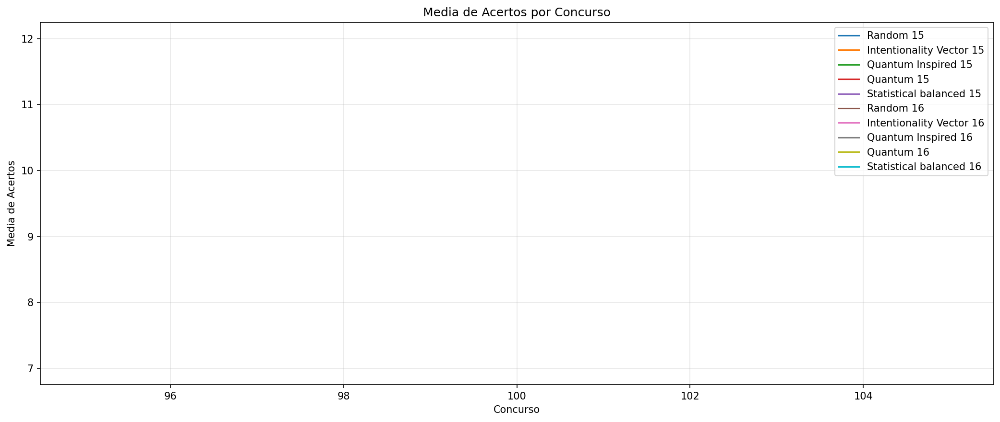
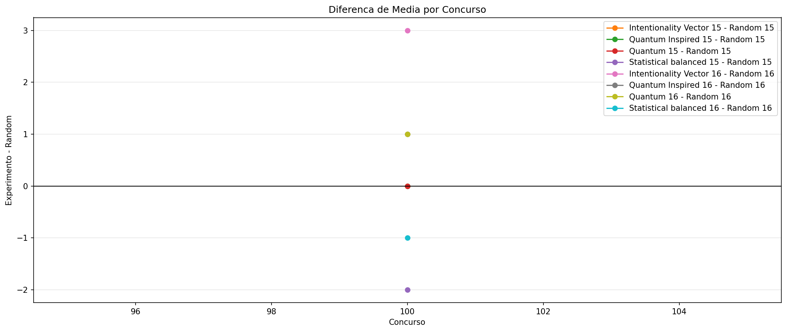
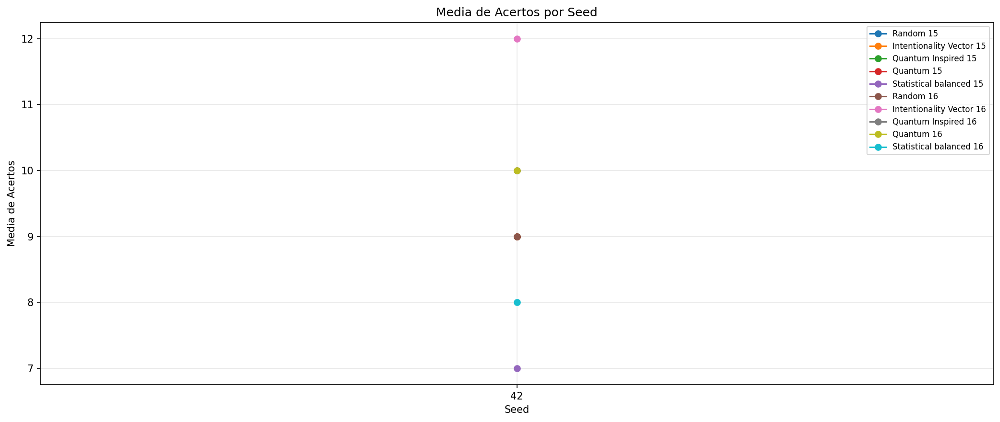
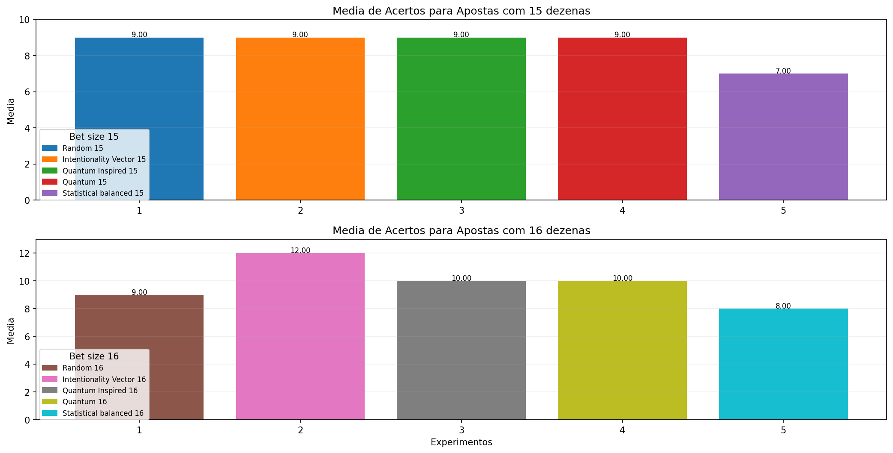

# Backtest Completo

- Data: 2026-04-07
- Concursos avaliados: 100 a 100
- Tickets por concurso: 1
- Tamanhos de aposta: 15, 16
- Janela de historico: 50
- Seed inicial: 42
- Quantidade de seeds: 1
- Seeds usadas: 42
- Presets comparados: balanced
- Runs totais: 10
- Concursos no intervalo: 1
- Tickets estimados: 10
- Custo estimado da bateria: R$ 297.50

## Estimativa de Custo

- 15 dezenas: R$ 17.50
- 16 dezenas: R$ 280.00

## Graficos

## Ranking Geral

- Melhor media: Intentionality Vector 16
- Melhor maximo de acertos: Intentionality Vector 16
- Melhor custo-beneficio: Random 15

### Ranking por Media

- Intentionality Vector 16: 12.00
- Quantum Inspired 16: 10.00
- Quantum 16: 10.00
- Random 15: 9.00
- Intentionality Vector 15: 9.00
- Quantum Inspired 15: 9.00
- Quantum 15: 9.00
- Random 16: 9.00
- Statistical balanced 16: 8.00
- Statistical balanced 15: 7.00

### Ranking por Maximo de Acertos

- Intentionality Vector 16: 12
- Quantum Inspired 16: 10
- Quantum 16: 10
- Random 15: 9
- Intentionality Vector 15: 9
- Quantum Inspired 15: 9
- Quantum 15: 9
- Random 16: 9
- Statistical balanced 16: 8
- Statistical balanced 15: 7

### Ranking por Custo-Beneficio

- Random 15: 2.571429
- Intentionality Vector 15: 2.571429
- Quantum Inspired 15: 2.571429
- Quantum 15: 2.571429
- Statistical balanced 15: 2.000000
- Intentionality Vector 16: 0.214286
- Quantum Inspired 16: 0.178571
- Quantum 16: 0.178571
- Random 16: 0.160714
- Statistical balanced 16: 0.142857

## Resumo por Seed

- Seed 42: media media=9.20, melhor max=12

## Resumo por Tamanho de Aposta

- 15 dezenas: media media=8.60, melhor max=9, melhor media por real=2.571429
- 16 dezenas: media media=9.80, melhor max=12, melhor media por real=0.214286

## Random 15

- Familia: random
- Preset: n/a
- Tamanho da aposta: 15
- Concursos avaliados: 1
- Tickets totais: 1
- Media de acertos: 9.00
- Maior numero de acertos: 9
- Menor numero de acertos: 9
- Custo da aposta: R$ 3.50
- Custo relativo: 1.00x
- Media por real: 2.571429
- Maximo por real: 2.571429

### Configuracao

- ticket_size: 15

### Distribuicao de Acertos

- 9 acertos: 1

### Resultados por Seed

- Seed 42: media=9.00, max=9, min=9

## Intentionality Vector 15

- Familia: intentionality_vector
- Preset: n/a
- Tamanho da aposta: 15
- Concursos avaliados: 1
- Tickets totais: 1
- Media de acertos: 9.00
- Maior numero de acertos: 9
- Menor numero de acertos: 9
- Custo da aposta: R$ 3.50
- Custo relativo: 1.00x
- Media por real: 2.571429
- Maximo por real: 2.571429

### Configuracao

- ticket_size: 15

### Distribuicao de Acertos

- 9 acertos: 1

### Resultados por Seed

- Seed 42: media=9.00, max=9, min=9

## Quantum Inspired 15

- Familia: quantum_inspired
- Preset: n/a
- Tamanho da aposta: 15
- Concursos avaliados: 1
- Tickets totais: 1
- Media de acertos: 9.00
- Maior numero de acertos: 9
- Menor numero de acertos: 9
- Custo da aposta: R$ 3.50
- Custo relativo: 1.00x
- Media por real: 2.571429
- Maximo por real: 2.571429

### Configuracao

- ticket_size: 15

### Distribuicao de Acertos

- 9 acertos: 1

### Resultados por Seed

- Seed 42: media=9.00, max=9, min=9

## Quantum 15

- Familia: quantum
- Preset: n/a
- Tamanho da aposta: 15
- Concursos avaliados: 1
- Tickets totais: 1
- Media de acertos: 9.00
- Maior numero de acertos: 9
- Menor numero de acertos: 9
- Custo da aposta: R$ 3.50
- Custo relativo: 1.00x
- Media por real: 2.571429
- Maximo por real: 2.571429

### Configuracao

- ticket_size: 15

### Distribuicao de Acertos

- 9 acertos: 1

### Resultados por Seed

- Seed 42: media=9.00, max=9, min=9

## Statistical balanced 15

- Familia: statistical
- Preset: balanced
- Tamanho da aposta: 15
- Concursos avaliados: 1
- Tickets totais: 1
- Media de acertos: 7.00
- Maior numero de acertos: 7
- Menor numero de acertos: 7
- Custo da aposta: R$ 3.50
- Custo relativo: 1.00x
- Media por real: 2.000000
- Maximo por real: 2.000000

### Configuracao

- frequency_weight: 0.45
- delay_weight: 0.35
- parity_weight: 0.1
- range_weight: 0.1
- min_numbers_per_range: 2
- max_consecutive_run: 3
- max_repeats_from_last_draw: 11
- max_attempts: 250
- ticket_size: 15
- min_even_numbers: 6
- max_even_numbers: 9

### Distribuicao de Acertos

- 7 acertos: 1

### Resultados por Seed

- Seed 42: media=7.00, max=7, min=7

## Random 16

- Familia: random
- Preset: n/a
- Tamanho da aposta: 16
- Concursos avaliados: 1
- Tickets totais: 1
- Media de acertos: 9.00
- Maior numero de acertos: 9
- Menor numero de acertos: 9
- Custo da aposta: R$ 56.00
- Custo relativo: 16.00x
- Media por real: 0.160714
- Maximo por real: 0.160714

### Configuracao

- ticket_size: 16

### Distribuicao de Acertos

- 9 acertos: 1

### Resultados por Seed

- Seed 42: media=9.00, max=9, min=9

## Intentionality Vector 16

- Familia: intentionality_vector
- Preset: n/a
- Tamanho da aposta: 16
- Concursos avaliados: 1
- Tickets totais: 1
- Media de acertos: 12.00
- Maior numero de acertos: 12
- Menor numero de acertos: 12
- Custo da aposta: R$ 56.00
- Custo relativo: 16.00x
- Media por real: 0.214286
- Maximo por real: 0.214286

### Configuracao

- ticket_size: 16

### Distribuicao de Acertos

- 12 acertos: 1

### Resultados por Seed

- Seed 42: media=12.00, max=12, min=12

## Quantum Inspired 16

- Familia: quantum_inspired
- Preset: n/a
- Tamanho da aposta: 16
- Concursos avaliados: 1
- Tickets totais: 1
- Media de acertos: 10.00
- Maior numero de acertos: 10
- Menor numero de acertos: 10
- Custo da aposta: R$ 56.00
- Custo relativo: 16.00x
- Media por real: 0.178571
- Maximo por real: 0.178571

### Configuracao

- ticket_size: 16

### Distribuicao de Acertos

- 10 acertos: 1

### Resultados por Seed

- Seed 42: media=10.00, max=10, min=10

## Quantum 16

- Familia: quantum
- Preset: n/a
- Tamanho da aposta: 16
- Concursos avaliados: 1
- Tickets totais: 1
- Media de acertos: 10.00
- Maior numero de acertos: 10
- Menor numero de acertos: 10
- Custo da aposta: R$ 56.00
- Custo relativo: 16.00x
- Media por real: 0.178571
- Maximo por real: 0.178571

### Configuracao

- ticket_size: 16

### Distribuicao de Acertos

- 10 acertos: 1

### Resultados por Seed

- Seed 42: media=10.00, max=10, min=10

## Statistical balanced 16

- Familia: statistical
- Preset: balanced
- Tamanho da aposta: 16
- Concursos avaliados: 1
- Tickets totais: 1
- Media de acertos: 8.00
- Maior numero de acertos: 8
- Menor numero de acertos: 8
- Custo da aposta: R$ 56.00
- Custo relativo: 16.00x
- Media por real: 0.142857
- Maximo por real: 0.142857

### Configuracao

- frequency_weight: 0.45
- delay_weight: 0.35
- parity_weight: 0.1
- range_weight: 0.1
- min_numbers_per_range: 2
- max_consecutive_run: 3
- max_repeats_from_last_draw: 11
- max_attempts: 250
- ticket_size: 16
- min_even_numbers: 7
- max_even_numbers: 10

### Distribuicao de Acertos

- 8 acertos: 1

### Resultados por Seed

- Seed 42: media=8.00, max=8, min=8