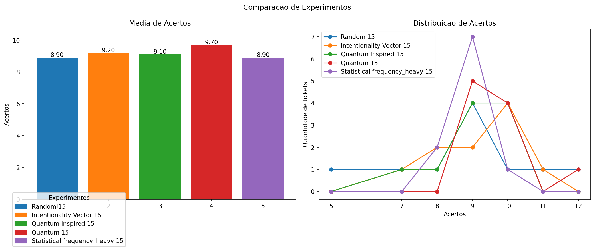
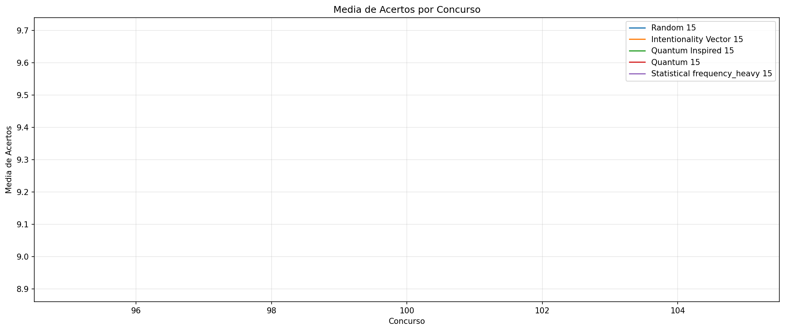
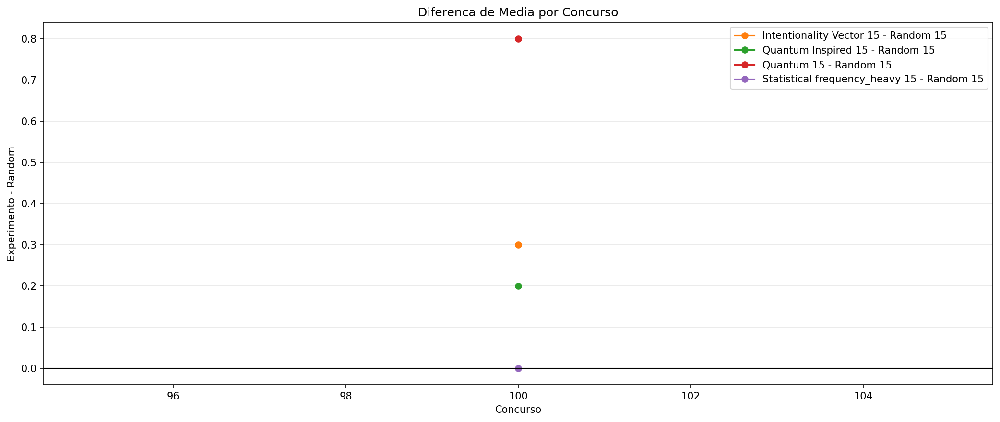
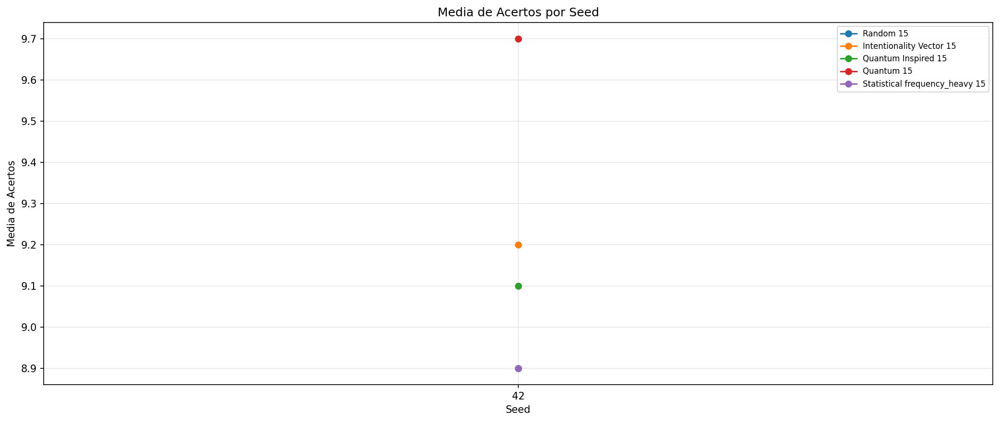
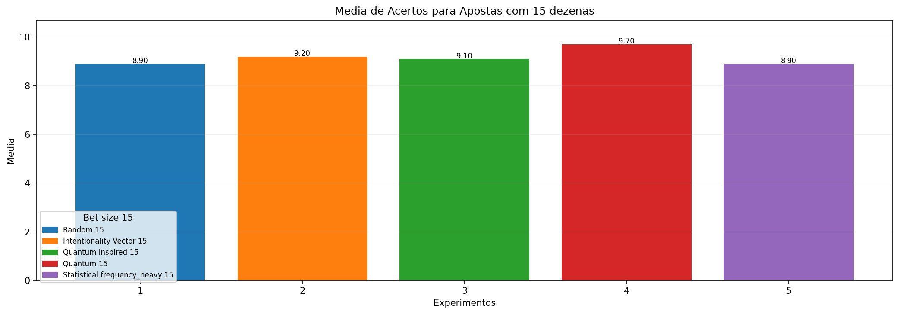

# Backtest Completo

- Data: 2026-04-07
- Concursos avaliados: 100 a 100
- Tickets por concurso: 10
- Tamanhos de aposta: 15
- Janela de historico: 20
- Seed inicial: 42
- Quantidade de seeds: 1
- Seeds usadas: 42
- Presets comparados: frequency_heavy
- Runs totais: 5
- Concursos no intervalo: 1
- Tickets estimados: 50
- Custo estimado da bateria: R$ 175.00

## Estimativa de Custo

- 15 dezenas: R$ 175.00

## Graficos

## Ranking Geral

- Melhor media: Quantum 15
- Melhor maximo de acertos: Random 15
- Melhor custo-beneficio: Quantum 15

### Ranking por Media

- Quantum 15: 9.70
- Intentionality Vector 15: 9.20
- Quantum Inspired 15: 9.10
- Random 15: 8.90
- Statistical frequency_heavy 15: 8.90

### Ranking por Maximo de Acertos

- Random 15: 12
- Quantum 15: 12
- Intentionality Vector 15: 11
- Quantum Inspired 15: 10
- Statistical frequency_heavy 15: 10

### Ranking por Custo-Beneficio

- Quantum 15: 2.771429
- Intentionality Vector 15: 2.628571
- Quantum Inspired 15: 2.600000
- Random 15: 2.542857
- Statistical frequency_heavy 15: 2.542857

## Resumo por Seed

- Seed 42: media media=9.16, melhor max=12

## Resumo por Tamanho de Aposta

- 15 dezenas: media media=9.16, melhor max=12, melhor media por real=2.771429

## Random 15

- Familia: random
- Preset: n/a
- Tamanho da aposta: 15
- Concursos avaliados: 1
- Tickets totais: 10
- Media de acertos: 8.90
- Maior numero de acertos: 12
- Menor numero de acertos: 5
- Custo da aposta: R$ 3.50
- Custo relativo: 1.00x
- Media por real: 2.542857
- Maximo por real: 3.428571

### Configuracao

- ticket_size: 15

### Distribuicao de Acertos

- 5 acertos: 1
- 7 acertos: 1
- 8 acertos: 1
- 9 acertos: 4
- 10 acertos: 1
- 11 acertos: 1
- 12 acertos: 1

### Resultados por Seed

- Seed 42: media=8.90, max=12, min=5

## Intentionality Vector 15

- Familia: intentionality_vector
- Preset: n/a
- Tamanho da aposta: 15
- Concursos avaliados: 1
- Tickets totais: 10
- Media de acertos: 9.20
- Maior numero de acertos: 11
- Menor numero de acertos: 7
- Custo da aposta: R$ 3.50
- Custo relativo: 1.00x
- Media por real: 2.628571
- Maximo por real: 3.142857

### Configuracao

- ticket_size: 15

### Distribuicao de Acertos

- 7 acertos: 1
- 8 acertos: 2
- 9 acertos: 2
- 10 acertos: 4
- 11 acertos: 1

### Resultados por Seed

- Seed 42: media=9.20, max=11, min=7

## Quantum Inspired 15

- Familia: quantum_inspired
- Preset: n/a
- Tamanho da aposta: 15
- Concursos avaliados: 1
- Tickets totais: 10
- Media de acertos: 9.10
- Maior numero de acertos: 10
- Menor numero de acertos: 7
- Custo da aposta: R$ 3.50
- Custo relativo: 1.00x
- Media por real: 2.600000
- Maximo por real: 2.857143

### Configuracao

- ticket_size: 15

### Distribuicao de Acertos

- 7 acertos: 1
- 8 acertos: 1
- 9 acertos: 4
- 10 acertos: 4

### Resultados por Seed

- Seed 42: media=9.10, max=10, min=7

## Quantum 15

- Familia: quantum
- Preset: n/a
- Tamanho da aposta: 15
- Concursos avaliados: 1
- Tickets totais: 10
- Media de acertos: 9.70
- Maior numero de acertos: 12
- Menor numero de acertos: 9
- Custo da aposta: R$ 3.50
- Custo relativo: 1.00x
- Media por real: 2.771429
- Maximo por real: 3.428571

### Configuracao

- ticket_size: 15

### Distribuicao de Acertos

- 9 acertos: 5
- 10 acertos: 4
- 12 acertos: 1

### Resultados por Seed

- Seed 42: media=9.70, max=12, min=9

## Statistical frequency_heavy 15

- Familia: statistical
- Preset: frequency_heavy
- Tamanho da aposta: 15
- Concursos avaliados: 1
- Tickets totais: 10
- Media de acertos: 8.90
- Maior numero de acertos: 10
- Menor numero de acertos: 8
- Custo da aposta: R$ 3.50
- Custo relativo: 1.00x
- Media por real: 2.542857
- Maximo por real: 2.857143

### Configuracao

- frequency_weight: 0.6
- delay_weight: 0.2
- parity_weight: 0.1
- range_weight: 0.1
- min_numbers_per_range: 2
- max_consecutive_run: 3
- max_repeats_from_last_draw: 12
- max_attempts: 250
- ticket_size: 15
- min_even_numbers: 6
- max_even_numbers: 9

### Distribuicao de Acertos

- 8 acertos: 2
- 9 acertos: 7
- 10 acertos: 1

### Resultados por Seed

- Seed 42: media=8.90, max=10, min=8